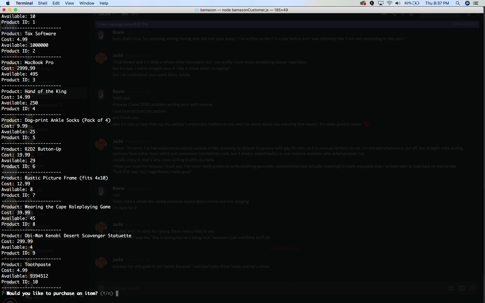
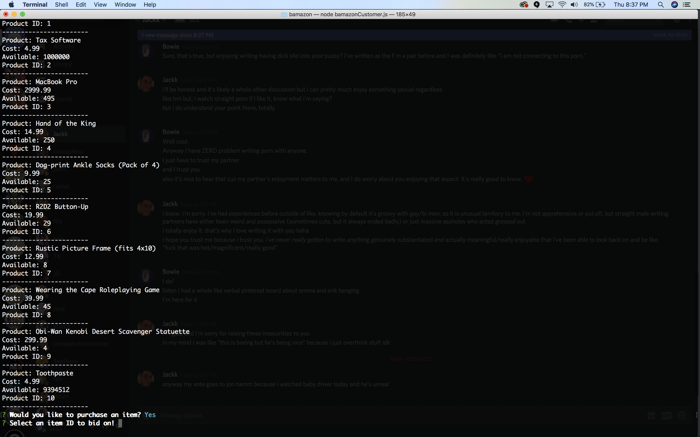

#~~amazon~~ ... I mean bamazon

##Overview

Shop to your heart's content with this absolutely intolerably simple Bamazon app, that will 100% not send you any item you buy. But good news: it won't cost you anything!

##Instructions
Opening it, you just need to run ```node bamazonCustomer.js``` to get going. This will provide you with a full inventory and a buying prompt, allowing you to choose whether or not you want to pick any of our ~~diverse~~ minimal inventory!

If you do decide to buy, it will prompt you to select an item ID! Why not just the name of the item? Because the scope specified an item ID!

Upon choosing an item, you'll be asked to choose the quantity you want to buy, answering for us the age old question: how many things of toothpaste can one person purchase?

Assuming you choose a valid pretend quantity, the items will pretend to be purchased, give you a pretend receipt, and let you pretend to buy more items if you choose! You can keep doing this forever and ever, even if we run out of pretend stock, because I didn't set it up to just tell you to leave when everything is at 0. (But I could...)

##Package Dependencies

* promise-mysql is an NPM package that uses mysql, but adds some functionality for promise statements.
* inquirer is an NPM package that manages a prompt system for our game handling.

## Screenshots
#Initial screen

#Initialize the node.


#Answer the prompt Yes to buy.

#Select the item ID to buy.

#Select the quantity to buy. I chose too many.

#Select the quantity to buy.

#Choose to buy another item.

#It gives a new screen of updated inventory.

#The rest still works


#Some foolproofing against erroneous entries.


## Authors

* **Bowie Sessions** - *Initial work* 

## Acknowledgments

* Thanks to Lynn for her assistance!
* Thanks to Joe and Rory for their hard work and advice!